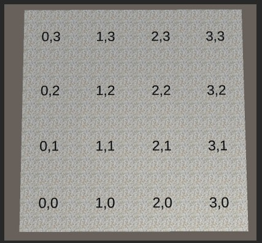
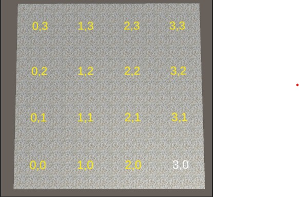
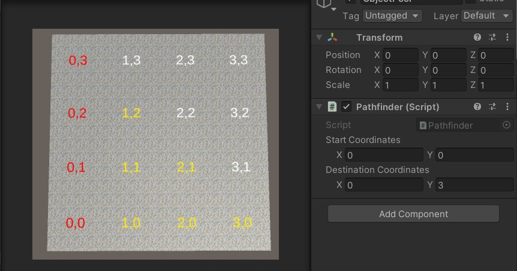
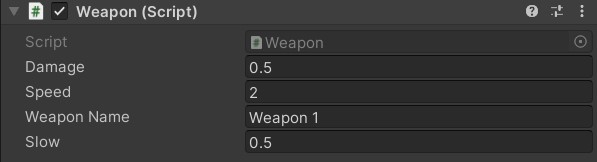

# Craft-Tower-Defense

## Log of progress

A grid manager class is responsible for storing information of grid nodes and their coordinate labeler

The pathfinder algorithm that will be used is BFS (on the grid nodes), and tile label color will be set according to the algorithms results

The path will be constructed using references created during the neighbor exploration in the algorithm

[Link](https://gifs.com/gif/enemymovement-6WzEzL)

The initial enemy prefab is added and now follows the path built previously.
An ObjectPool class will be used to instantiate the enemies with a predefined size and timer between instantiations (using a coroutine)
Enemies are predefined and are enabled/disabled instead of destroyed (which is more efficient).

Nodes can now be blocked before runtime which calls (broadcast message from Pathfinder class) the enemies to recalculate their path to the destination node. The situation where the node will cause the path to be blocked is prevented (illegal).

[Tower and obstacle](https://j.gifs.com/pZ7RxX.gif) (gif too large)

Initial tower and obstacle prefab implemented, which can be instantiated using mouse click (left click for tower, right for obstacle). Both of these objects will block the node on which they are placed.

Tower weapon implemented. Towers are able to slow, damage, and destroy enemies.

Implemented initial Tower Menu UI. The player can select any active towers on the field and a menu opens with options to strengthen the selected tower with various stats.

Obstacles and towers come at a cost and the player can now see remaining resources (current balance and obstacle count)

Enemies come in waves of various types and difficulty throughout the level

Alert system will inform the player if he is trying to make an invalid action (i.e block path) & provide information
in various events.

07-03-22: [Design updates](https://youtu.be/Qh6J83ogJNA)

17-04-22: [Design updates](https://youtu.be/7FFUguo6MXk)

Particle systems added for various events, randomized movement implemented