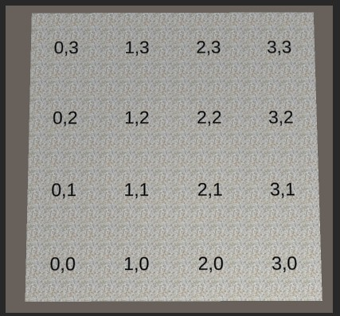
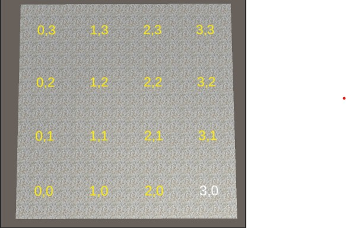

# Craft-Tower-Defense

## Log of progress

- Added gridManager to store information of grid nodes and grid coordinate labeler, used for debugging:

- Added Pathfinder with BFS traversal which uses the grid of nodes 
- Tile label colors dynamically set according to BFS traversal

